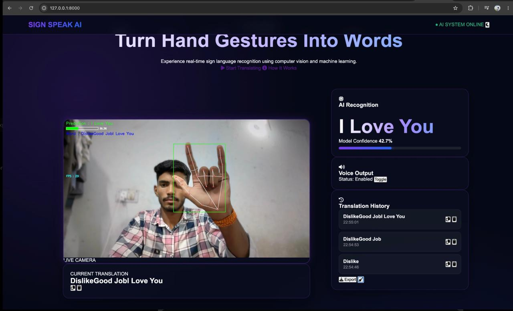

# 🤟 Sign Speak AI — Real-Time Sign Language Translator

An intelligent web application that detects and translates American Sign Language (ASL) gestures into real-time text and speech using Computer Vision and Machine Learning.

---

## 📸 Project Demo



---

### ✨ Key Features
- 🎥 **Real-time Gesture Recognition:** Powered by MediaPipe Hands & OpenCV for low-latency hand tracking.
- 🧠 **Trained ML Classifier:** Accurately classifies hand landmarks into corresponding sign letters/words.
- 🌐 **Interactive Web Interface:** Built using Flask, HTML5, CSS3, and JavaScript.
- 🔊 **Text-to-Speech & Real-time Output:** Instant translation display for seamless communication.

---

### 🛠️ Tech Stack

- **Backend / Core:** Python, Flask
- **Computer Vision & ML:** OpenCV, MediaPipe, Scikit-learn, NumPy, Pandas
- **Frontend:** HTML5, CSS3, JavaScript

---

### 🚀 Getting Started

#### 1. Clone the Repository

```bash
git clone https://github.com/pritam-khadda/sign-language-translator.git
cd sign-language-translator